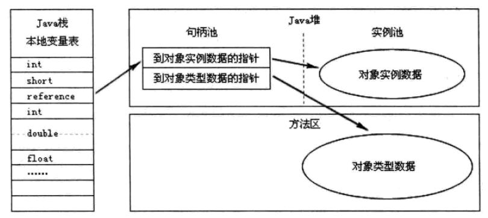
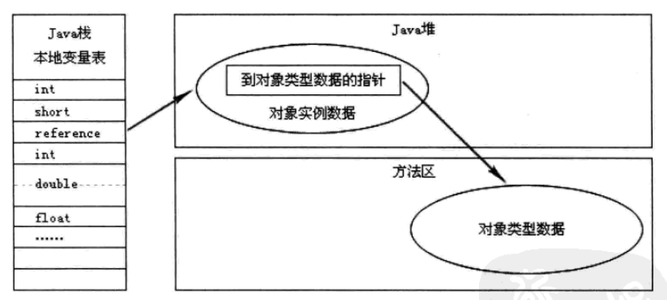

# **深入理解Java虚拟机**
# Java内存区域与内存溢出异常
## 2.2 运行时数据区域

### 2.2.1 程序计数器
- 是一块较小的内存空间，同时也称之为 “线程私有”的内存。
- 是当前线程所执行的字节码的行号指示器。
- 字节码解释器工作时就是通过改变这个计数器的值来选取下一条需要执行的字节码指令，分支、循环、跳转、异常处理、线程恢复等基础功能都需要依赖这个计数器来完成。
- 为了线程切换后能恢复到正确的执行位置，每条线程都需要有一个独立的程序计数器，各条线程之间的计数器互不影响，独立存储。
-

### 2.2.2 Java虚拟机栈
- Java虚拟机栈也时候线程私有的，它的生命周期与线程相同。
- 虚拟机栈描述的是Java方法执行的内存模型
    - 每个方法在执行的同时都会创建一个栈帧
    - 栈帧用于存储局部变量表、操作数栈、动态链接、方法出口等信息
    - 一个方法从调用直至执行完成的过程，就对应着一个栈帧在虚拟机中入栈到出栈的过程
#### 局部变量表

- 存放了编译器可知的各种基本数据类型（boolean、byte、char、short、int、float、long、double)
- 存放了对象引用（reference类型，它不等同于对象本身，可能是一个指向对象起始地址的引用指针，也可能是指向一个代表对象的句柄或其他与此对象相关的位置）
- returnAddress类型（指向了一个字节码指令的地址）
- 其中64位长度的long和double类型的数据占用了2个局部变量空间（Slot），其余的数据类型只占用1个
- 局部变量表所需的内存空间是在编译期间完成分配的，当进入一个方法时，这个方法需要在栈帧中分配多大的局部变量空间是完全确定的，在方法运行期间不会改变局部变量表的大小。
- 这个区域的两种异常状况
    - 如果线程请求的栈深度大于虚拟机所允许的深度，将抛出StackOverflowError异常
    - 如果虚拟机栈可以动态扩展，如果扩展时无法申请到足够的内存空间，就会抛出OutOfMemoryError异常
### 2.2.3 本地方法栈
- 它与虚拟机栈所发挥的作用非常地相似，它们之间的区别不过是虚拟机栈为虚拟机执行Java方法（也就是字节码）服务，而本地方法栈则为虚拟机使用到的Native方法服务
- Sun HotSpot 虚拟机直接把本地方法栈和虚拟机栈合二为一。
- 与虚拟机栈一样，本地方法栈区域也会抛出StackOverflowError和OutOfMemoryError异常
### 2.2.4 Java堆
- 对于大多数应用来说，Java堆是Java虚拟机所管理的的内存中最大的一块。
- 它是被所有线程共享的一块内存区域，在虚拟机启动时创建
- **它的唯一目的就是存方对象实例**
- Java虚拟机规范中描述：所有的对象实例以及数组都要在堆上分配，但也并不是**绝对的**
- Java堆可以是物理上不连续的内存空间，只要逻辑上是连续的即可
### 2.2.5 方法区
- 方法区与Java堆一样，它是各个线程共享的内存区域，用于存储已被虚拟机加载的类信息、常量、静态变量、即时编译器编译后的代码等数据
### 2.2.6 运行时常量池
- 它是方法区的一部分。
- Class文件中除了有类的版本、字段、方法、接口等描述信息之外，还有一项信息是常量池，用于存放编译器生成的各种字面量和符号引用，这部分内容将在类加载后进入方法去的运行时常量池中存放
### 2.2.7 直接内存
-  直接内存并不是虚拟机运行时数据区的一部分，也不是Java虚拟机规范中定义的内存区域，但是这部分内存也会被频繁地使用，而且也可能会导致OOM异常。
- **NIO** 引入了一种基于通道（Channel）与缓冲区（Buffer）的I/O方式，它可以使用Native函数库直接分配堆外内存，然后通过一个存储在Java堆里面的
DirectByteBuffer对象作为这块内存的引用进行操作，这样能显著提高性能，因为避免了在Java堆和Native堆中来回复制数据。
## 2.3 对象访问
reference类型在Java虚拟机规范里面只规定了一个指向对象的引用，并没有定义这个引用应该通哪种方式去定位，以及访问到Java堆中的对象的具体位置。
目前主流的两种访问方式为：使用句柄和直接指针。
- 使用句柄访问方式，Java堆将会划出一块内存来作为句柄池，reference中存储的就是对象的句柄地址，而句柄中包含了对象实例数据和类型数据各自的具体地址信息，如下图所示：

使用句柄访问方式的最大优点就是reference中存储的是稳定的句柄地址，在对象被移动（垃圾回收时移动对象）时
只会改变句柄中的实例数据指针，而reference本身不需要被修改

- 使用直接指针访问方式，Java堆对象的布局中就必选考虑如何放置访问类型数据的相关信息，reference中直接存储的就是对象地址，如下图所示：

使用指针访问方式的最大好处就是速度更快，它节省了一次指针定位的时间开销，由于对象的访问在Java中非常频繁，因此这类开销积少成多后也会是一项非常可观的
执行成本。其中 Sun HotSpot使用就是直接指针访问的方式。

# 3.垃圾收集器与内存分配策略

## 3.2 对象已死
### 3.2.1 引用计数算法
- 给对象中添加一个引用计数器，每当一个地方引用它时，计数器就加1;但引用失效时，计数器就减1；任何时刻，计数器都为0的对象就是不可能被使用的。
- Java语言中没有选用引用计数算法来管理内存，其中最主要的原因是他很难解决对象之间的相互循环引用的问题。

### 3.2.2 根搜索算法
**基本思路**
- 通过一系列的名为“GC Roots”的对象作为起始点，从这些节点开始向下搜索，搜索所走过的路径称为引用链（Reference Chain）,
当一个对象到GC Roots没有任何引用链相连（用图论的话来说，就是从GC Roots到这个对象不可达）时，则证明此对象时不可用的。
- 在Java语言中，可作为GC Roots的对象包括下面几种：
    - 虚拟机栈（栈帧中的本地变量表）中的引用的对象。
    - 方法区中的类静态属性引用的对象。
    - 方法区中的常量引用的对象。
    - 本地方法栈中JNI（即一般说的Native方法）的引用的对象
### 3.2.3 再谈引用
- 在JDK1.2 之前，Java中的引用的定义很传统：如果reference类型的数据中存储的数值代表的是另一块内存的起始地址，
就称之为这块内存的一个引用
- 在JDK1.2 之后，将引用分为强引用（Strong Reference）、软引用（Soft Reference）、弱引用（Weak Reference）、虚引用（Phantom Reference）
这四种引用强度依次逐渐减弱。
    - 强引用就是指在程序代码之中普遍存在的，类似“Object obj = new Object()”这类的引用，只要强引用还存在，垃圾收集器永远不会回收掉被引用的对象。
    - 软引用用来描述一些还有用，但并非必需的对象。对于软引用关联着的对象，在系统将发生内存溢出异常之前，将会把这些对象列进回收范围只会并进行第二次回收。
    如果这次回收还是没有足够的内存，才会抛出内存溢出异常。在JDK1.2之后，提供了SoftReference类来实现软引用。
    - 弱引用也是用来描述非必需对象的，但是它的强度比软引用更弱一些，被弱引用关联的对象只能生存到下一次垃圾收集发生之前。当垃圾收集器工作时，无论当前的内存是否足够，都会
    回收掉纸杯弱引用关联的对象，在JDK1.2之后，提供了WeakReference类来实现弱引用。
    - 虚引用也称为幽灵引用或者幻影引用，它时最弱的一种引用关系。**一个对象是否有虚引用的存在，完全不会对其生存时间构成影响，也无法通过虚引用来取得一个对象实例**。
    为一个对象设置虚引用关联的唯一目的就是希望能在这个对象被收集器回收时收到一个系统通知。早JDK1.2之后，提供PhantomReference类来实现虚引用。

### 3.2.4 生存还是死亡？
- 在搜索算法中，不可达的对象也并非是“非死不可”，要真正宣告一个对象死亡，至少**要经历两次标记过程**：如果对象在进行根搜索后发现没有与GC Roots相连接的引用链，那它将会被一次标记并且进行
第一次筛选，筛选的条件是**此对象是否有必要执行finalize()方法**。当对象没有覆盖finalize()方法，或者finalize()方法已经被虚拟机调用过，虚拟机将这两种情况都视为**没有必要执行**

- 当一个对象被判定为有必要执行finalize()方法，那么这个对象将会被放置在一个名为F-Queue的队列之中，并在稍后有一条虚拟机自动建立的、低优先级的Finalizer线程去执行。
- finalize()方法是对象逃脱死亡命运的最后一次机会，只要对象在finalize()方法中成功拯救自己 ---- 只要重新与引用链上的任何建立关联即可，譬如把自己（this关键字）
赋值给某个类变量或对象的成员变量，那在第二次标记时它将会被移除出“即将回收”的集合。
    它的流程大概如下：
- 任何一个对象的finalize()方法都只会被系统自动调用一次，如果对象面临下一次回收，它的finalize()方法都不会被再次执行。
- finalize()能做的所有的工作，使用try-finally 或其他方式都是可以做得更好、更及时。
### 3.2.5 回收方法区
- 方法区 ---- HotSpot虚拟机中的永久代
- 在堆中，尤其是在新生代中，常规应用进行一次垃圾收集一般可以回收70%~95%空间，而永久代的垃圾收集效率远低于此。
- 永久代的垃圾收集主要回收两部分的内容：废弃常量和无用的类。
- 判断一个常量是否是“废弃常量”比较简单，而要判断一个类是否是“无用的类”的条件则相对苛刻许多，类同时满足下面3个条件才能算是“无用的类”：
    - 该类所有的实例都已经被回收，也就是Java堆中不存在该类的任何实例。
    - 加载该类的ClassLoader已经被回收。
    - 该类对应的java.lang.Class对象没有在任何地方呗引用，无法在任何地方通过反射访问该类的方法。
## 垃圾收集算法
### 3.3.1 标记 - 清除算法
- 最基础的收集算法。
- 分为“标记”和“清除”两个阶段：首先标记出所有需要回收的对象，在标记完成后统一回收掉所有被标记的对象。
- 主要缺点：1、效率问题，标记和清除过程的效率都不高。 2、空间问题，标记清除之后产生大量不连续的内存碎片，空间碎片太多可能会导致，当程序在以后的运行过程中需要分配较大对象时无法找到足够的连续
内存而不得不提前出发赢一次垃圾收集动作。
### 3.3.2 复制算法
- 它将可用内容按容量划分为大小相等的两块，每次只使用其中一块。当这一块内存用完了，就将还存活的对象复制到另外一块上面，然后再把已使用过的内存空间一次清理掉。
- 现在的商业虚拟机都采用这种算法来回收新生代，但不是按照1:1的比例来划分内存空间，而是将内存分为一块较大的Eden空间和两块较小的survivor空间，每次使用Eden和其中的一块Survivor。
当回收时，将Eden和Survivor中还存活着的对象一次性地拷贝到来那个另外一块Survivor空间上，最后清理掉Eden和刚才使用过的Survivor的空间。
- HotSpot虚拟机默认Eden和Survivor的大小比例是8:1，也就是每次新生代中的可用空间为这个那个新生代容量的90%（80%+10%），只有10%的内存是会被“浪费”的。
### 3.3.3 标记 - 整理算法
复制收集算法在对象存活率较高时就要执行较多的复制操作，效率将变低，更关键的是，如果不浪费50%的空间，就需要有额外的空间进行分配担保，以应对被使用的内存中所有对象100%存活的极情况
### 3.3.4 分代收集算法
- 根据对象的存活周期的不同将内存分为几块，一般分为：新生代和老年代
- 这样就可以根据各个年代的特点采用最适合的收集算法。
- 在新生代中，每次垃圾收集时都返现有大批对象死去，只有少量存活，那就选用复制算法，只需要付出少量存活对象的复制成本就可以完成收集。
- 在老年代中，因为对象存活率高、没有额外的空间对他进行分配担保，就必须使用“标记 - 清理”或“标记 - 整理算法”来进行回收。
## 3.4 垃圾收集器

### 3.4.1 Serial收集器
- 是JDK1.3之前，虚拟机新生代收集的唯一选择。
- 单线程收集器 ---- 它在进行垃圾收集时，必须暂停其他所有工作线程（Sun将这件事情称之为 “Stop The world”），直到它收集结束。
- 简单而高效
- Serial收集器对于运行在Client模式下的虚拟机来说是一个很好的选择。
### 3.4.2 ParNew收集器
- 是Serial收集机器的多线程版本，除了使用多条线程进行垃圾收集之外，其余的行为包括Serial收集器可用的所有控制参数、收集算法、Stop the World、
对象分配规则、回收策略等都与Serial收集器完全一样，
- 它时许多运行在Server模式下的虚拟机中首选的新生代收集器
### 3.4.3 Parallel Scavenge收集器
- 新生代收集器，使用复制算法，并行的多线程收集器。
- 它的关注点与其他的收集器不同，CMS等收集器的关注点尽可能地缩短垃圾收集时用户线程的停顿时间，而Parallel Scavenge收集器的目标则是达到一个可控制的
吞吐量。吞吐量 = 运行用户代码时间 /(运行用户代码时间 + 垃圾收集时间)。
- 停顿时间越短就越适合需要与用户交互的程序，良好的响应速度能提升用户的体验：而高吞吐量则可以最高效地利用CPU时间，尽快地完成程序的运算任务，主要适合在后台运算而不需要太多交互的任务。
### 3.4.4 Serial Old收集器
- 是Serial收集器的老年代版本
- 同样是一个单线程收集器，使用“标记 - 整理”算法
### 3.4.5 Parallel Old 收集器
- 是Parallel Scavenge收集器的老年代版本，使用多线程和“标记 - 整理”算法。
### 3.4.6 CMS收集器
- 是一种以获取最短回收时间为目标的收集器。
- 基于“标记 - 清除”算法实现的。
- 它的运作过程分为4个步骤：
    - 初始标记(CMS initial mark)
        - 需要“Stop The world”
        - 仅仅是标记一下GC Roots能直接关联到的对象，速度很快
    - 并发标记(CMS concurrent mark)
        - 这个阶段就是进行GC Roots Tracing的过程
    - 重新标记(CMS remark)
        - 需要”Stop The World“
        - 该过程是为了修正并发标记期间，因用户程序继续运行而导致标记产生表动的那一部分对象的标记记录，这个阶段的停顿时间一般会比初始标记阶段稍长一些，
        但比并发标记时间短。
    - 并发清除(CMS concurrent sweep)
  * 由于整个过程中耗时最长的并发标记和并发清除过程中，收集器线程都可以与用户线程一起工作，所以总体来说，CMS收集器的内存回收过程是与用户线程一起并发地执行的。
- 并发收集，低停顿
- 三个显著的缺点：
    - CMS收集器堆CPU资源非常敏感。
    - CNS收集器无法处理浮动垃圾（Floating Garbage），可能出现“Concurrent Mode Failure”失败而导致另一次Full GC的产生
    - 当CMS运行期间预留的内存无法满足程序的需要，就会出现一次“Concurrent Mode Failure”失败。
    - 收集结束时出现大量空间碎片
### G1收集器
- **G1(Garbage First)** 收集器时当前收集器技术发展最前沿成果。
- G1收集器时基于“标记 - 整理”算法实现的收集器，也就是说它不会产生空间碎片。
- 可以非常精确地控制停顿，既能让使用者明确地指定在一个长度为M毫秒的时间片段内，消耗在垃圾收集上的时间不得超过N毫秒，这几乎已经实时Java(RTSJ)
的垃圾收集器的特征了。
- G1收集器将整个Java堆（包括新生代、老年代）划分为多个大小固定的独立区域（Region），并且跟踪这些区域里面的垃圾堆积程度，在后台维护一个优先列表，每次根据允许的收集时间，
优先回收垃圾最多的区域（这就是Garbage First名称的由来）

### 3.4.8 垃圾收集器参数总结
## 3.5 内存分配与回收策略
- 给对象分配内存以及回收分配给对象的内存。
### 3.5.1 对象优先在Eden分配
